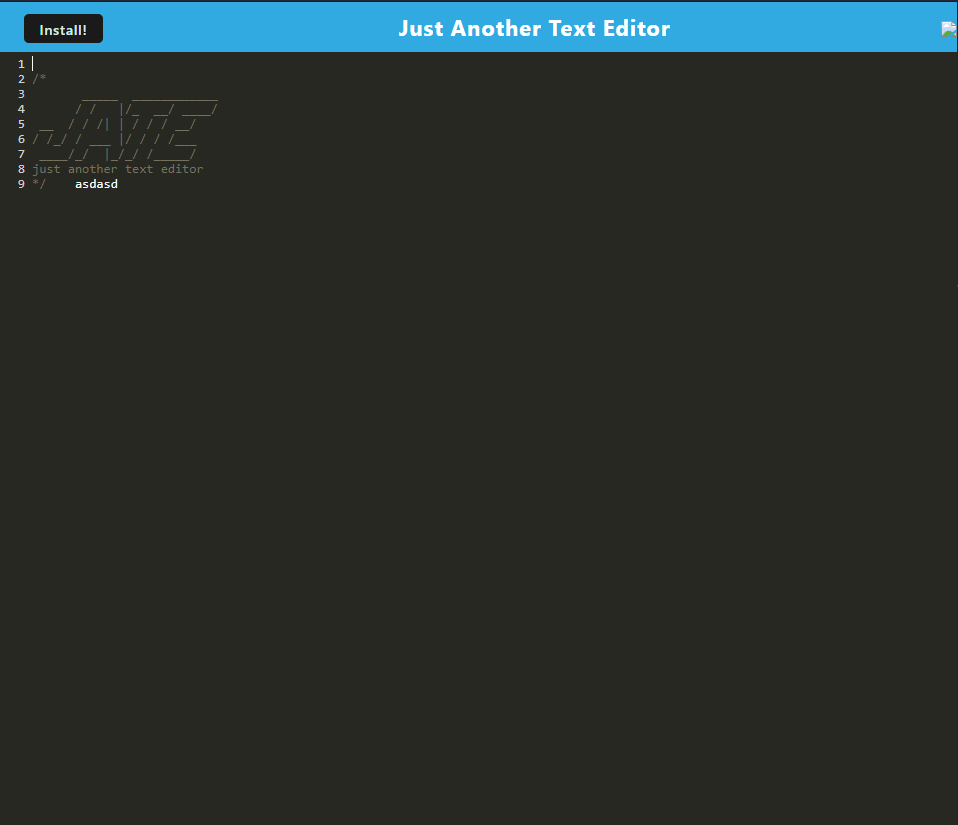

# progressive-text-editor

## 
  
# Table of Contents:
  
  1. [Description](#description)
  2. [Installation](#installation)
  3. [Usage](#usage)
  4. [Contributors](#contributors)
  5. [License](#license)
  6. [Screenshot](#screenshot)
  7. [Link](#link)
  8. [Tests](#tests)
  9. [Questions](#questions)
 10. [Citing Credit](#citing)
  
## Description 

    This is JATE. A text editor that runs in your browser or nativley on your machine using the install button! It can be used to prototype code out in a simple and lightweight package.

      
## Installation 

Installation is optional, and all you need to do is click the install button at the top of the screen! 
## Usage 

  
 This would be most useful in having a place to store code snippets, or type something out quick for later use or to edit a block of text quickly.

      
  
## Contributors 

 ttieman
  
## License 

  ### This application is covered under the [MIT LICENSE](https://opensource.org/licenses/MIT),
  and should be referred to for any questions about legal licensure considering 
  this application. 

## ScreenShot  

## Link

To the Application:
[https://dashboard.heroku.com/apps/pwa-jate-editor](https://dashboard.heroku.com/apps/pwa-jate-editor)  

To the Repo:
[https://github.com/ttieman/progressive-text-editor](https://github.com/ttieman/progressive-text-editor)  
  
  
## Tests 

### The tests ran for this application were done through user experience.
  
## Questions 

  
### If you have and questions my git hub user is [ttieman](https://github.com/ttieman)
  
### My email is tiemantanner@gmail.com if you wish to reach out to me directly.

## Citing Credit

 Web3 schools was used for referencing javascript elements while building this application!

 [https://www.w3schools.com/](https://www.w3schools.com/)

 I used Web packs documentation to include the pwa functionality in this application!

[https://webpack.js.org/](https://webpack.js.org/)
